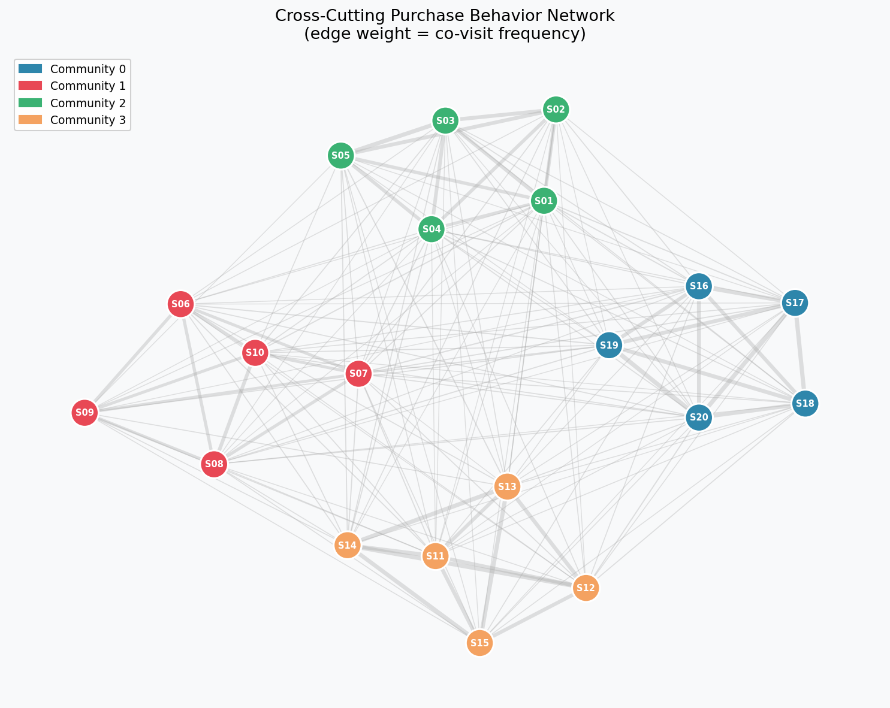
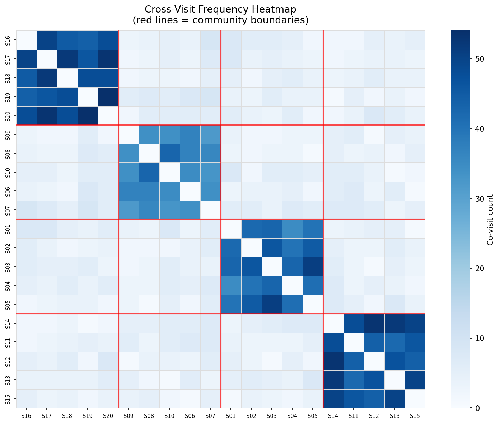
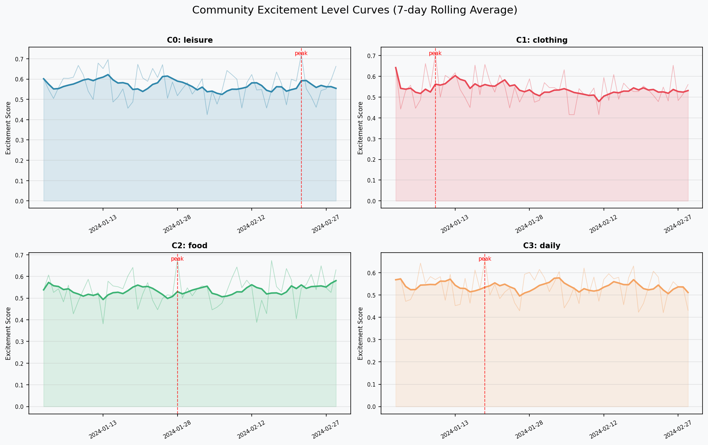
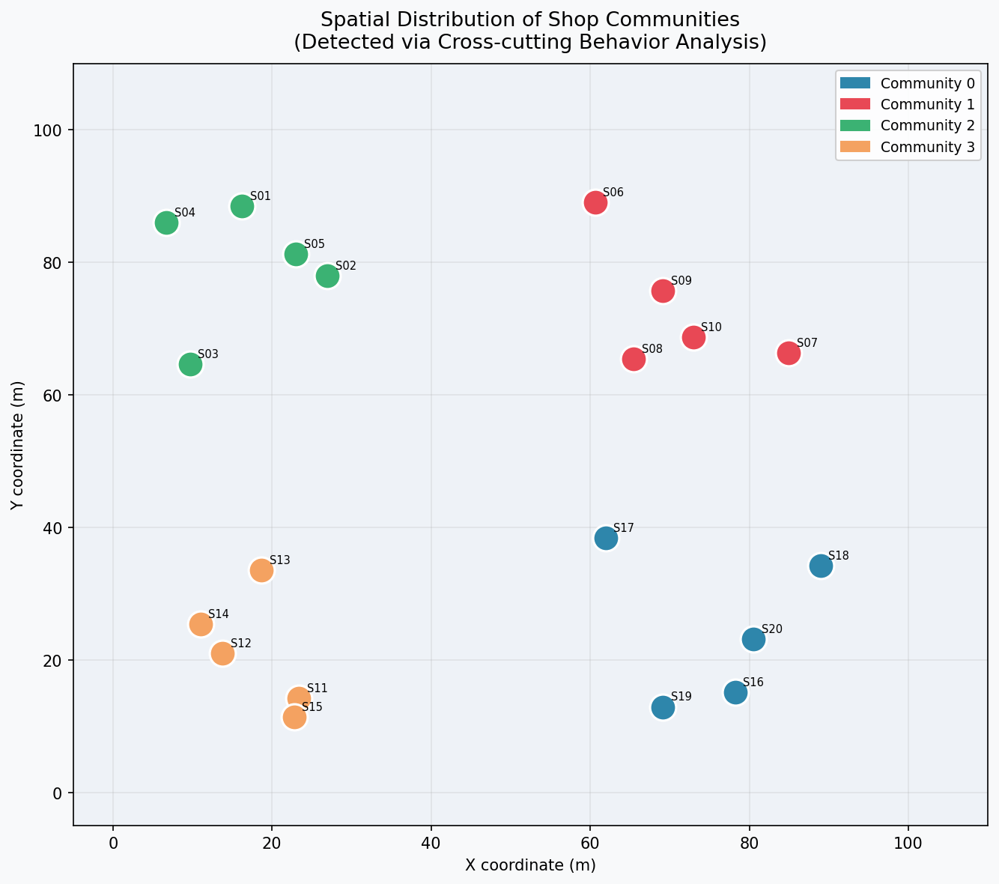
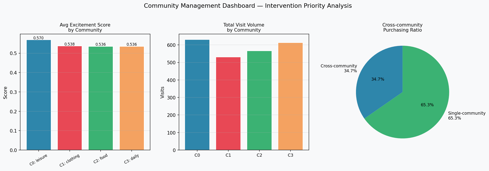

# Shopping District Community Analysis
### Cross-Cutting Purchasing Behavior × IoT Sensor Integration for Low-Digitalized Districts

A data-driven framework for community-based management of low-digitalized shopping districts. This project integrates simulated IoT sensor streams with purchasing behavior network analysis to detect hidden community clusters and support targeted management interventions.

---

## Overview

Traditional shopping district management relies on intuition and periodic surveys. This framework provides a scalable, data-driven alternative that works even in districts with limited digital infrastructure — using lightweight IoT sensors and existing POS-compatible logs.

**Three-layer pipeline:**

```
[Data Layer]   IoT Simulator + Purchase Log Generator + Excitement Curve Builder
      ↓
[Analysis Layer]   Cross-visit Network → Louvain Community Detection → Temporal Trend Analysis
      ↓
[Application Layer]  Spatial Visualization + Intervention Priority Dashboard
```

---

## Key Results

### Figure 1 — Cross-Cutting Purchase Behavior Network
Each node is a shop. Edge weight represents the number of customers who visited both shops. Communities are detected via Louvain modularity optimization.



---

### Figure 2 — Cross-Visit Frequency Heatmap
Co-visit matrix ordered by community assignment. Red lines mark community boundaries. Dense blocks along the diagonal confirm strong intra-community cohesion.



---

### Figure 3 — Community Excitement Level Curves
Daily excitement scores aggregated per community, combining foot traffic, dwell time, and spending amount from IoT data. Red dashed lines mark peak excitement dates — candidate days for targeted interventions.



---

### Figure 4 — Spatial Distribution of Communities
Geographic layout of shops, colored by detected community. Spatial clustering (or its absence) reveals whether purchasing communities align with physical proximity.



---

### Figure 5 — Intervention Priority Dashboard
Left: Average excitement score per community. Center: Total visit volume. Right: Cross-community purchasing ratio — the proportion of customers who crossed community boundaries, a key indicator of district-wide social capital.



---

## Repository Structure

```
shopping-district-analysis/
├── simulator.py            # Synthetic IoT + purchase log generator
├── network_analysis.py     # Co-visit matrix, shop network, motif stats
├── community_detection.py  # Louvain community detection + inter-community flow
├── excitement_analysis.py  # Excitement curve aggregation + anomaly detection
├── visualize.py            # All figure generation
├── main.py                 # End-to-end pipeline runner
├── requirements.txt
└── outputs/                # Generated figures and CSV/JSON results
    ├── fig1_community_network.png
    ├── fig2_covisit_heatmap.png
    ├── fig3_excitement_curves.png
    ├── fig4_spatial_map.png
    ├── fig5_dashboard.png
    ├── purchase_log.csv
    ├── iot_data.csv
    ├── community_assignments.csv
    ├── network_stats.csv
    ├── excitement_anomalies.csv
    └── flow_stats.json
```

---

## Quick Start

```bash
git clone https://github.com/<your-username>/shopping-district-analysis.git
cd shopping-district-analysis
pip install -r requirements.txt
python main.py
```

All figures are saved to `outputs/`.

---

## Methodology

### 1. Data Simulation
- **20 shops** with spatial coordinates and category labels
- **400 synthetic customers** with probabilistic community preferences (92% intra-community, 8% cross-community)
- **~2,340 purchase transactions** over 60 days
- **IoT data**: daily foot traffic count, dwell time, and excitement score per shop

### 2. Cross-Cutting Behavior Network
A weighted undirected graph is built where an edge between shops A and B has weight = number of customers who visited both. This "cross-cutting" representation captures latent behavioral affinities beyond geographic proximity.

### 3. Community Detection
Louvain modularity optimization is applied to the shop-to-shop network. The algorithm maximizes within-community edge density relative to a null model, producing stable community assignments without requiring a predefined number of clusters.

### 4. Excitement Level Curves
For each community, a composite excitement score is computed daily:

```
excitement = 0.4 × (foot_traffic / baseline)
           + 0.3 × (dwell_time / baseline)
           + 0.3 × (avg_spend / baseline)
```

A 7-day rolling average smooths noise. Z-score anomaly detection flags unusual excitement peaks and troughs as candidate intervention points.

### 5. Intervention Dashboard
Community-level aggregates are synthesized into an actionable dashboard: excitement rankings, visit volume, and cross-community purchasing ratio — the fraction of customers who span multiple communities and thus serve as social capital connectors.

---

## Sample Output Summary

| Metric | Value |
|--------|-------|
| Shops | 20 |
| Customers | 400 |
| Purchase records | ~2,340 |
| Detected communities | 4 |
| Network modularity | 0.495 |
| Cross-community ratio | 34.7% |
| Excitement anomalies | 38 |

---

## Dependencies

| Package | Version |
|---------|---------|
| networkx | 3.2.1 |
| python-louvain | 0.16 |
| matplotlib | 3.8.2 |
| seaborn | 0.13.0 |
| pandas | 2.1.4 |
| numpy | 1.26.3 |
| scipy | 1.11.4 |

---

## License

MIT License
