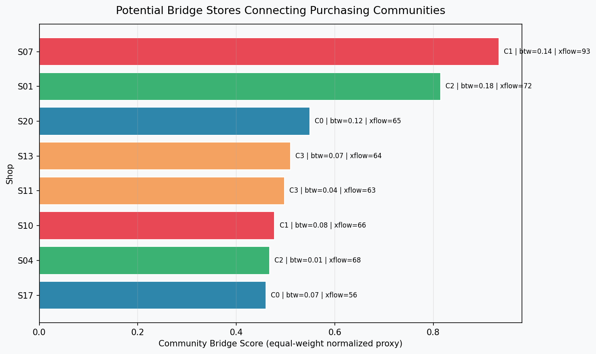
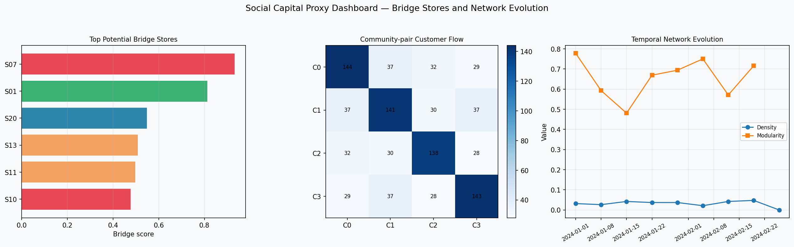

# Update: Social Capital Proxy Analysis for Bridge Store Detection

This update adds a preliminary social capital proxy analysis module for identifying potential bridge / hub stores in low-digitalized shopping districts.

The extension builds on the original cross-cutting purchasing behavior network and introduces additional network-based indicators for evaluating how different purchasing communities are connected through specific stores.

---

## Motivation and Related Work

This update is motivated by research on commercial district management, cross-cutting purchasing behavior, stamp rally data analysis, and social capital dynamics in commercial areas.

Prof. Yuya Ieiri's recent research investigates how consumer behavior data can support community-based management in low-digitalized shopping districts. His work on Area-POS data, regional currency logs, stamp rally data, and commercial district networks suggests that purchasing behavior can reveal latent community structures and key stores that connect different customer groups.

In particular, research directions related to commercial district social capital and hub-store detection are closely connected to this update. Commercial districts are not only economic spaces but also social interaction networks. Stores that connect different purchasing communities may function as potential bridge nodes, traffic builders, or social capital connectors.

However, the present implementation does not directly measure social capital in the sociological sense. It does not use real questionnaire data, real regional currency logs, real stamp rally records, or real sensor observations.

Instead, this update provides a preliminary computational proxy analysis based on synthetic purchasing and IoT simulation data. The goal is to evaluate whether network-based indicators can help identify potential bridge stores that connect different purchasing communities.

Related research directions include:

a Community-based management for low-digitalized shopping districts
b Cross-cutting purchasing behavior analysis
c Commercial district network analysis
d Stamp rally data and hub-store detection
e Social capital dynamics in commercial areas
f Data-driven intervention support for local shopping districts

This update should therefore be understood as a preliminary computational extension inspired by these research directions, rather than a direct empirical validation of social capital in a real commercial district.

---

## Results and Figures

### 1. Potential bridge stores connecting purchasing communities



This figure shows the top-ranked potential bridge stores detected from the purchasing co-visit network.

Each shop is evaluated using several interpretable network indicators:

- betweenness centrality
- cross-community edge count
- cross-community flow
- normalized community bridge proxy score

The goal is to identify stores that may connect multiple purchasing communities rather than simply ranking stores by total visit volume.

In the current synthetic benchmark, `S07` and `S01` appear as the strongest potential bridge stores. These stores are not only embedded within their own detected communities, but also show relatively strong connections across community boundaries.

This suggests that such stores may play a role similar to bridge stores, traffic builder stores, or social capital connectors in a commercial district network.

---

### 2. Social capital proxy dashboard



This dashboard summarizes the social capital proxy analysis from three perspectives.

#### Top potential bridge stores

The left panel shows the stores with the highest community bridge proxy scores. These stores are potential candidates for targeted interventions, such as stamp rally campaigns, coupon distribution, information sharing, or community-linking events.

#### Community-pair customer flow

The center panel shows the customer flow between detected purchasing communities.

The diagonal values represent within-community purchasing flows, while the off-diagonal values represent cross-community flows. A district with only isolated communities would show strong diagonal blocks and weak off-diagonal connections. In contrast, the presence of off-diagonal flows indicates that some customers move across different purchasing communities.

This cross-community movement is treated as a proxy signal for inter-community connectivity.

#### Temporal network evolution

The right panel shows weekly changes in network density and modularity.

This is a preliminary attempt to observe how the cohesion and separation of purchasing communities change over time. Since the current data are synthetic and the final time window may contain fewer observations, these temporal results should be interpreted carefully.

The purpose of this panel is not to claim real social capital change, but to demonstrate how the framework could be extended to analyze social capital evolution when real longitudinal data become available.

---

## Summary of Numerical Results

The update generated the following key results:

| Metric | Value |
|---|---:|
| Detected communities | 4 |
| Network modularity | 0.4945 |
| Cross-community purchasing ratio | 34.7% |
| Top bridge store | S07 |
| Top bridge store score | 0.933 |
| Excitement anomalies | 38 |

The top bridge store ranking indicates that `S07` has the highest bridge proxy score in the current synthetic dataset.

The community-pair flow matrix also shows that while within-community purchasing flows are dominant, cross-community flows are still present. This supports the idea that cross-cutting purchasing behavior can provide useful signals for understanding how different customer groups and store clusters are connected.

---

## Method

This update adds a new module:

```bash
social_capital_proxy_analysis.py
```

The module extends the existing analysis pipeline by computing social capital proxy indicators from the purchasing co-visit network.

The main steps are:

1. Load the detected shop communities from the Louvain community detection result.
2. Load or reconstruct the weighted shop co-visit network.
3. Compute store-level network centrality indicators.
4. Compute cross-community connection indicators.
5. Calculate a normalized community bridge proxy score.
6. Generate a bridge store ranking table.
7. Generate a community-pair customer flow matrix.
8. Compute weekly network evolution indicators.
9. Export CSV, JSON, and visualization outputs.

The analysis focuses on the following indicators:

| Indicator | Description |
|---|---|
| Cross-community purchasing ratio | Fraction of customers whose purchase behavior crosses detected community boundaries |
| Betweenness centrality | Measures whether a store lies on paths connecting different parts of the network |
| Cross-community edge count | Number of network connections from a store to stores in other communities |
| Cross-community flow | Total weighted co-visit flow from a store to stores in other communities |
| Community bridge proxy score | Normalized proxy score combining centrality and cross-community connection indicators |
| Network density over time | Weekly density of the purchasing co-visit network |
| Modularity over time | Weekly modularity of detected purchasing communities |

The community bridge proxy score is used only as a practical ranking indicator. It should not be interpreted as a direct or definitive measurement of social capital.

---

## Generated Files

After running the pipeline, the following new files are generated in the `outputs/` directory:

```bash
fig6_bridge_store_ranking.png
fig7_social_capital_proxy_dashboard.png
social_capital_bridge_store_ranking.csv
social_capital_community_pair_flow.csv
social_capital_temporal_network_evolution.csv
social_capital_summary.json
```

### Output descriptions

| File | Description |
|---|---|
| `fig6_bridge_store_ranking.png` | Visualization of top potential bridge stores |
| `fig7_social_capital_proxy_dashboard.png` | Dashboard summarizing bridge stores, community-pair flow, and temporal network evolution |
| `social_capital_bridge_store_ranking.csv` | Store-level bridge ranking and network indicators |
| `social_capital_community_pair_flow.csv` | Flow matrix between detected purchasing communities |
| `social_capital_temporal_network_evolution.csv` | Weekly density and modularity indicators |
| `social_capital_summary.json` | Summary of key social capital proxy metrics |

---

## How to Run

From the project root directory, run:

```bash
python main.py
```

The full pipeline will generate synthetic purchase and IoT data, build the purchasing co-visit network, detect communities, analyze excitement curves, compute inter-community flow statistics, and run the social capital proxy analysis.

The output files will be generated in:

```bash
outputs/
```

To inspect the generated files, open:

```bash
outputs/fig6_bridge_store_ranking.png
outputs/fig7_social_capital_proxy_dashboard.png
outputs/social_capital_bridge_store_ranking.csv
outputs/social_capital_summary.json
```

---

## Relation to the Original Project

The original project focused on integrating simulated IoT sensor data with cross-cutting purchasing behavior analysis for low-digitalized shopping districts.

It included:

- synthetic IoT and purchase log generation
- purchasing co-visit network construction
- Louvain community detection
- excitement curve analysis
- inter-community flow statistics
- intervention priority dashboard

This update extends the project toward social capital proxy analysis.

Instead of replacing the original pipeline, it adds a focused network analysis layer for identifying stores that may connect different purchasing communities. This makes the project more directly connected to research questions about commercial district social capital, community connectivity, and hub-store-based management interventions.

---

## Notes and Limitations

This extension should be understood as a preliminary proxy analysis.

It does not directly measure social capital. In particular, it does not include:

- real commercial district purchasing records
- real regional currency logs
- real stamp rally data
- real IoT sensor deployment
- questionnaire-based social capital measurement
- causal evaluation of interventions
- validation with field data

The current analysis is based on synthetic data generated by the project simulator. Therefore, the numerical results should not be interpreted as empirical findings about a real shopping district.

The main purpose of this update is to demonstrate that cross-cutting purchasing networks can be extended toward interpretable social capital proxy indicators and bridge-store detection.

With real longitudinal purchase logs, regional currency data, stamp rally records, or lightweight IoT sensing data, this framework could be further developed into an empirical tool for analyzing how commercial districts evolve as social interaction networks.
